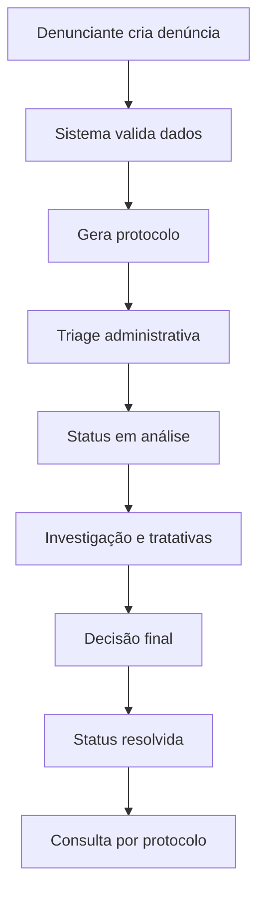
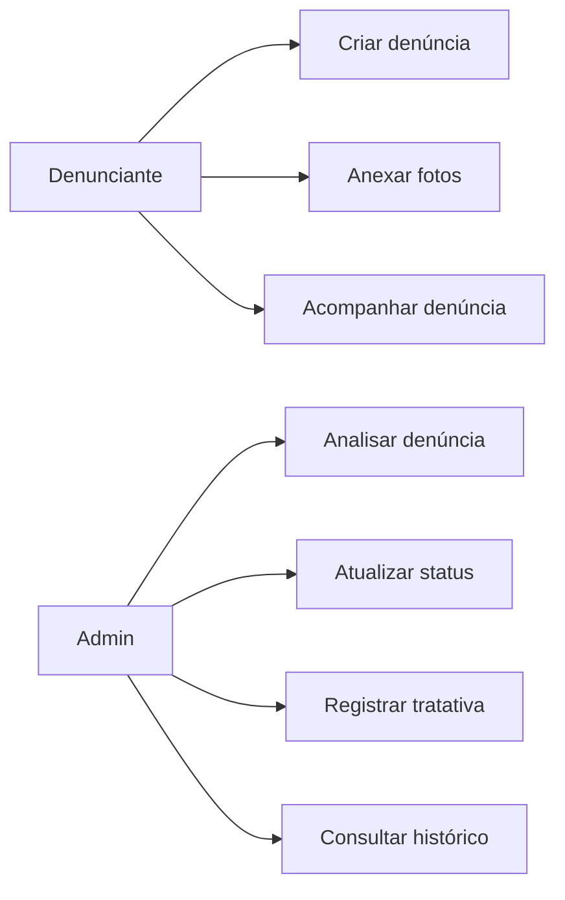
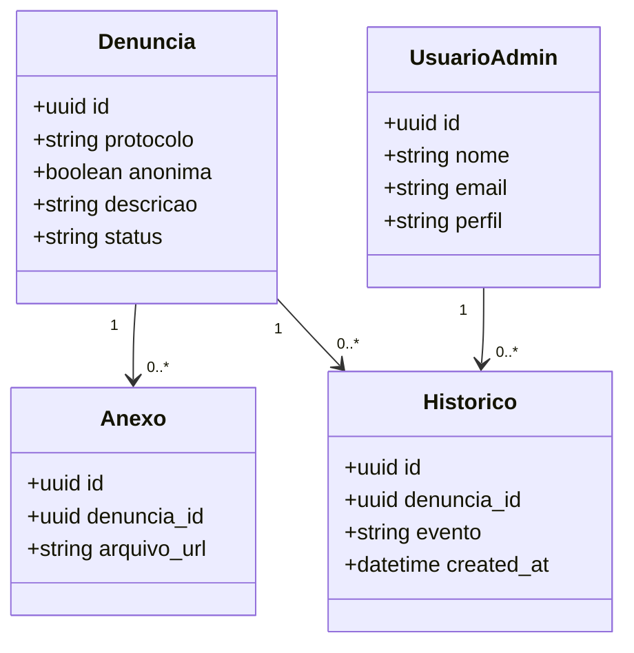

# PRD - Canal de Denúncias e Proteção à Saúde Mental

## 1. Visão do Produto

### 1.1 Nome provisório
Canal de Denúncias Psicossociais

### 1.2 Problema
Trabalhadores precisam de um meio seguro, acessível e rastreável para registrar denúncias relacionadas a fatores de risco psicossociais no ambiente de trabalho. Sem um processo estruturado, há subnotificação, baixa confiança no canal e demora na condução de tratativas, aumentando o risco de adoecimento mental e acidentes de trabalho.

### 1.3 Objetivo Geral
Implementar uma plataforma digital para recebimento, triagem, investigação e acompanhamento de denúncias, com foco em confidencialidade, conformidade com LGPD e eficiência no tratamento de riscos psicossociais.

### 1.4 Objetivos Específicos
- Facilitar o acesso de comunicação aos trabalhadores para formalização da denúncia.
- Auxiliar na identificação e investigação dos fatores de risco psicossociais presentes, minimizando impactos de adoecimento e acidentes de trabalho.

## 2. Escopo

### 2.1 Escopo Inicial (MVP)
- Criar denúncia (anônima ou identificada).
- Anexar evidências em imagem na denúncia (opcional).
- Acompanhar denúncia por protocolo.
- Gestão administrativa de denúncias no backend.
- Registro de status: aberta, em análise, resolvida.
- Histórico de mudanças e tratativas.

### 2.2 Fora do Escopo no MVP
- Chat em tempo real entre denunciante e equipe.
- Integrações com sistemas externos de RH/ERP.
- Automações avançadas por IA para classificação automática.
- App mobile nativo.

## 3. Requisitos Funcionais

### RF-01 Criar denúncia
- O sistema deve permitir registrar denúncia anônima ou identificada.
- Campos mínimos: nome da empresa, setor, tipo da ocorrência, descrição, local, data aproximada do fato.
- O sistema deve gerar protocolo único para consulta.

### RF-02 Upload de evidências
- O sistema deve permitir anexar fotos como comprovação (opcional).
- O sistema deve validar tipo e tamanho do arquivo.

### RF-03 Acompanhamento da denúncia
- O denunciante deve consultar o andamento via protocolo.
- O sistema deve exibir nome da empresa, setor, status atual e histórico cronológico.

### RF-04 Gestão administrativa
- O backend deve expor recursos para administração de denúncias.
- A funcionalidade administrativa deve existir no frontend, porém não deve ser exibida na navegação pública.
- Alterações administrativas devem ser auditáveis.

### RF-05 Gestão de status
- Status permitidos: aberta, em análise, resolvida.
- Mudança de status deve registrar usuário responsável, data/hora e observação.

### RF-06 Histórico
- Todo evento relevante deve gerar histórico: criação, atualização, mudança de status, tratativa e anexos.

## 4. Requisitos Não Funcionais

### RNF-01 Segurança e anonimato
- Dados de denúncia anônima não podem conter identificação obrigatória.
- Acesso administrativo deve exigir autenticação e autorização por perfil.
- Criptografia em trânsito obrigatória (HTTPS).
- Logs com trilha de auditoria sem exposição indevida de dados pessoais.

### RNF-02 LGPD
- Base legal e finalidade devem ser explicitadas no fluxo de denúncia.
- Coleta mínima necessária de dados pessoais.
- Política de retenção e descarte de dados definida.
- Controle de acesso restrito por necessidade operacional.

### RNF-03 Performance
- API com latência alvo p95 < 500ms para operações sem upload.
- Upload com resposta de aceite em tempo adequado à rede do usuário.

### RNF-04 Disponibilidade e operação
- Deploy em Vercel em projeto único (frontend + backend).
- Observabilidade mínima: logs estruturados, correlação por `request_id`, monitoramento de falhas.

### RNF-05 UX/UI
- Interface funcional, simples e objetiva.
- Estilo visual intencionalmente acadêmico, compatível com projeto de aluno de ADS.
- Não buscar acabamento visual premium no MVP.

## 5. Fluxo de Processo (BPM simplificado)

1. Trabalhador registra denúncia (anônima ou identificada).
2. Sistema gera protocolo e confirma recebimento.
3. Equipe responsável realiza triagem inicial.
4. Denúncia recebe status `em análise`.
5. Investigação e tratativas são registradas no histórico.
6. Conclusão da tratativa e atualização para `resolvida`.
7. Denunciante consulta progresso por protocolo.

### 5.1 Diagrama BPM (alto nível)


## 6. Regras de Negócio

- RN-01: Denúncia anônima não exige identificação de denunciante.
- RN-02: Denúncia identificada deve armazenar consentimento e dados mínimos.
- RN-03: Toda denúncia deve possuir protocolo único e imutável.
- RN-04: Status inicial obrigatório: `aberta`.
- RN-05: Apenas perfil administrativo pode mudar status.
- RN-06: Não é permitido editar histórico já registrado; apenas adicionar novos eventos.
- RN-07: Anexos devem aceitar apenas formatos de imagem permitidos.

## 7. Perfis de Usuário

- Denunciante anônimo: cria e acompanha denúncia por protocolo.
- Denunciante identificado: cria e acompanha denúncia com dados pessoais.
- Analista/Admin: triagem, investigação, atualização de status, registro de tratativas.

## 8. Stack Tecnológica

- Frontend: React + CSS (sem Tailwind).
- Backend: TypeScript.
- Banco de dados: Supabase (PostgreSQL + Storage).
- Hospedagem: Vercel (projeto único com frontend + backend).

## 9. Arquitetura (visão inicial)

### 9.1 Frontend
- Páginas públicas: criar denúncia, consultar protocolo.
- Módulo administrativo implementado no código, porém oculto da navegação pública.

### 9.2 Backend
- API REST para denúncias, anexos, histórico e autenticação administrativa.
- Camada de regras para transição de status e trilha de auditoria.

### 9.3 Banco
- Supabase PostgreSQL para dados transacionais.
- Supabase Storage para imagens anexadas.

## 10. Modelagem de Dados (proposta)

### 10.1 Entidades principais
- `denuncias`
- `denuncias_anonimas` ou flag de anonimato na denúncia
- `anexos_denuncia`
- `historico_denuncia`
- `usuarios_admin`
- `tratativas`

### 10.2 Campos mínimos sugeridos

#### Tabela `denuncias`
- `id` (uuid, pk)
- `protocolo` (varchar, único)
- `anonima` (boolean)
- `nome_denunciante` (nullable)
- `email_denunciante` (nullable)
- `nome_empresa` (varchar)
- `setor` (varchar)
- `descricao` (text)
- `tipo_ocorrencia` (varchar)
- `local` (varchar)
- `data_ocorrencia_aprox` (date, nullable)
- `status` (enum: aberta, em_analise, resolvida)
- `created_at` (timestamp)
- `updated_at` (timestamp)

#### Tabela `anexos_denuncia`
- `id` (uuid, pk)
- `denuncia_id` (uuid, fk)
- `arquivo_url` (text)
- `arquivo_nome` (varchar)
- `mime_type` (varchar)
- `created_at` (timestamp)

#### Tabela `historico_denuncia`
- `id` (uuid, pk)
- `denuncia_id` (uuid, fk)
- `evento` (varchar)
- `detalhes` (text)
- `ator_tipo` (varchar: sistema/admin)
- `ator_id` (uuid, nullable)
- `created_at` (timestamp)

#### Tabela `usuarios_admin`
- `id` (uuid, pk)
- `nome` (varchar)
- `email` (varchar, único)
- `perfil` (varchar)
- `ativo` (boolean)
- `created_at` (timestamp)

## 11. Diagramas Acadêmicos

### 11.1 Caso de Uso


### 11.2 Diagrama de Classes (conceitual)


## 12. Estrutura de Pastas Recomendada

```txt
/frontend
  /src
    /pages
    /components
    /styles
    /admin
/backend
  /src
    /modules
    /middlewares
    /routes
/supabase
  /migrations
```

### Regra obrigatória de migrations
Todas as migrations SQL devem ser criadas e mantidas **exclusivamente** na pasta `supabase/migrations`. A execução das migrations será feita manualmente depois, no **SQL Editor do Supabase**. Nenhuma migration deve ficar solta fora dessa pasta.

## 13. Critérios de Aceite do MVP

- É possível criar denúncia anônima e identificada.
- É possível anexar foto opcional na denúncia.
- Protocolo é gerado e permite consulta posterior.
- Status segue fluxo `aberta -> em análise -> resolvida`.
- Histórico exibe eventos relevantes.
- Recursos administrativos funcionam via backend e frontend implementado, porém sem exibição pública no frontend.
- Estrutura de migrations está separada em `supabase/migrations` para execução no SQL Editor do Supabase.

## 14. Riscos e Mitigações

- Risco: quebra de anonimato por logging indevido.
- Mitigação: sanitizar logs e limitar dados sensíveis.

- Risco: upload de arquivos maliciosos.
- Mitigação: validar MIME, tamanho e restringir tipos permitidos.

- Risco: uso indevido do módulo administrativo oculto no frontend.
- Mitigação: controle real de autorização no backend; ocultação visual não é segurança.

## 15. Roadmap Técnico Pós-MVP

- Implementar autenticação robusta com MFA para admins.
- Adicionar matriz de risco psicossocial por categoria de denúncia.
- Criar dashboards de indicadores (tempo médio de resolução, reincidência, volume por setor).
- Evoluir trilha de auditoria e políticas de retenção LGPD automatizadas.
