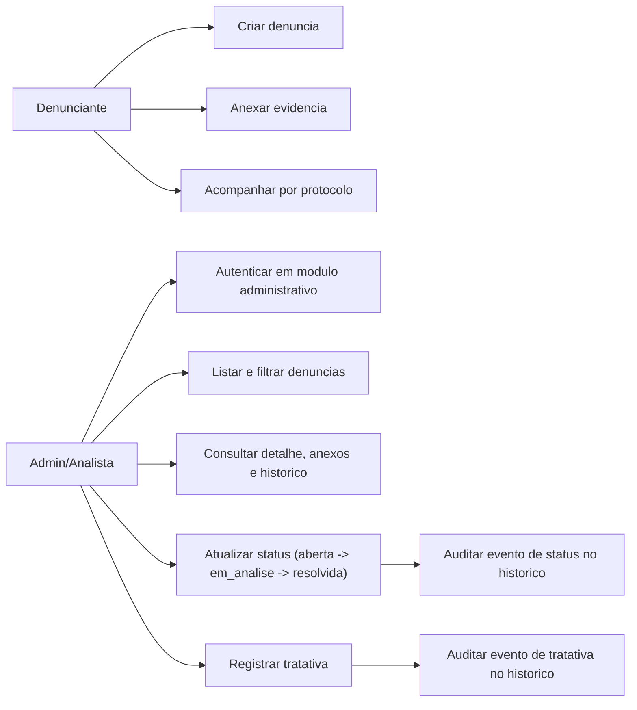
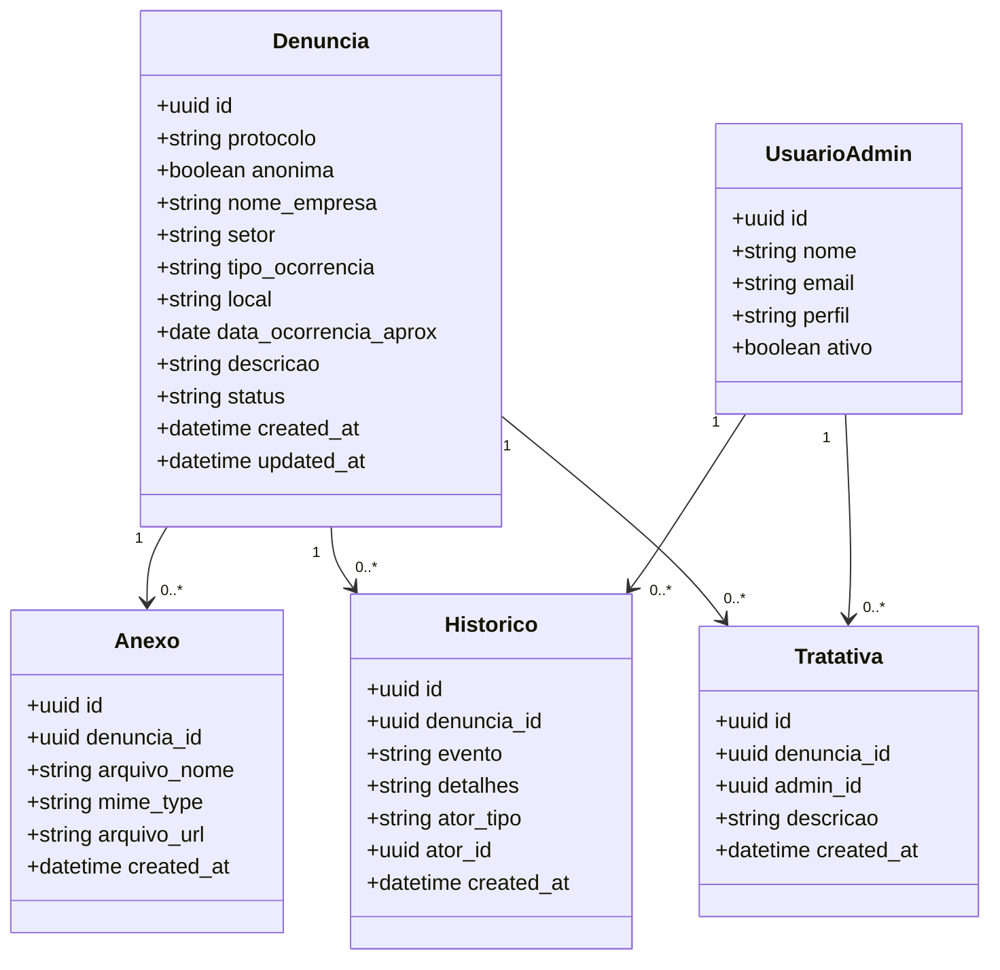

# Spec - Diagramas Acadêmicos (Caso de Uso e Classes)

## Objetivo
Consolidar os diagramas acadêmicos exigidos para documentação de projeto.

## Diagrama de Caso de Uso

## Diagrama de Classes (conceitual)

## Critérios de Aceite
- Diagramas renderizam corretamente em Markdown compatível com Mermaid.
- Entidades e casos de uso refletem o escopo do PRD.
